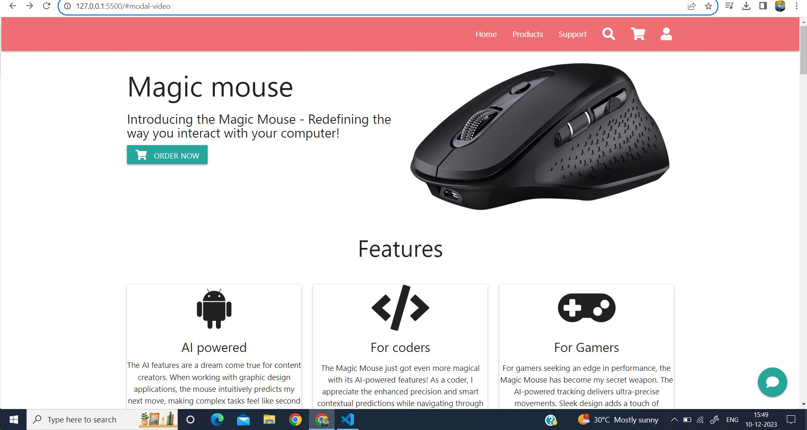

This project was created as a part of my internship in Slash Mark. It showcases the creation of a responsive, material design framework. The project features a smooth, realistic, and interactive user experience, including customizable chat interfaces and seamless integrations with various backend systems.

The project also includes an in-depth exploration of accessibility features and includes extensive support for users with visual impairments. It utilizes modern web development practices and follows the best coding standards and conventions to ensure high-quality, efficient, and scalable code.

###Some of the key features of the web app include:

Responsive design ensuring optimal viewing experience across various devices and screen sizes.
Customized and animated buttons to provide an interactive experience for users.
Easy navigation and clear user interface for a smooth browsing experience.
Accessibility features designed to support users with visual impairments.
In-app chat interfaces to facilitate seamless communication between users.
Seamless integrations with backend systems for smooth functionality and efficient data management.
To use the project, you can simply clone the repository and run the web app using a web server.

Feel free to explore the project and provide feedback. This internship project was an opportunity for me to apply and demonstrate my web development skills in a practical, real-world setting.
 

